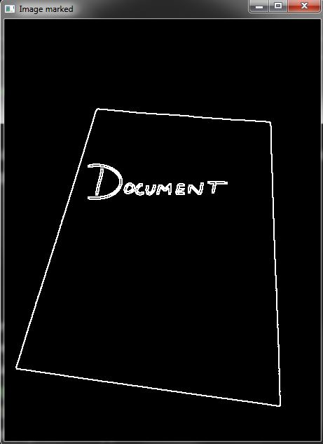
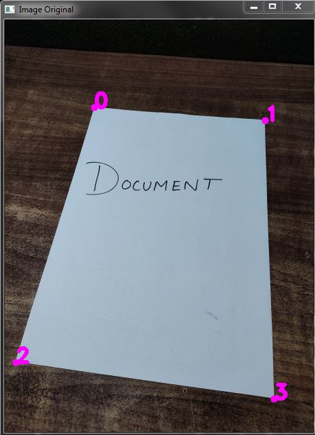
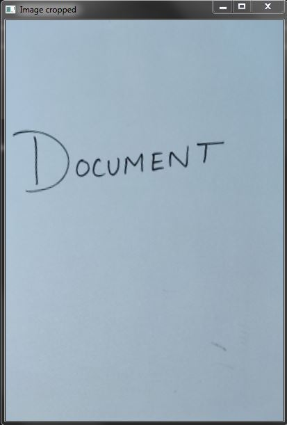

# OpenCV-Document-Scanner-Project
This program uses OpenCV Library in which I have done the following steps:
1. Resized the image to 0.5 scale
- **Pre-Processing**
2. Converted the image to gray scale
3. Blured the image using GaussianBlur function
4. Using Canny function I will detect the edges present in the image
5. Canny Image: 	\
   
- **Get_contours**
6. defined the function which will detect the corners of the document in the image
7. Using the canny-image we filter the areas of the objects present in the image and by obvious while scanning for an document our document will be covering the largest area in our image. 
8. Using filtration by area we detected the largest and using findcontours function we places the corners to the document
9. Like this:		\
    
- **Reordering the corners**
10. I have defined the reorder function because the in the above steps there can be multiple chances that the numbering of corners get misplaced as this is requires to warp the target document. So to keep in order the corners numbering we will use the reorder function
- **Finally warping**
11. Using the corners of the edges detected we can warp the image and crop out the document
12. i have defined a matrix which consist the new points of the final image.
13. Using the above matrix and warpperspective function I have scanned the document Successfully
14. Final Scanned document:   \
    

- We can scan a document out of an image or from a live feed video by just mentioning the path into the program.

